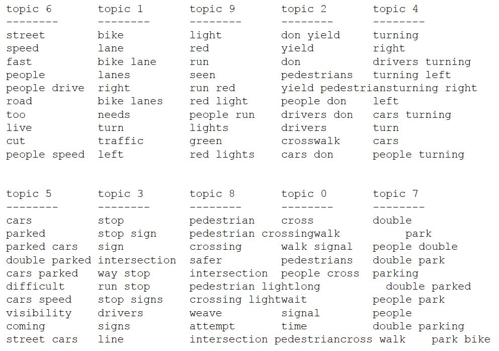
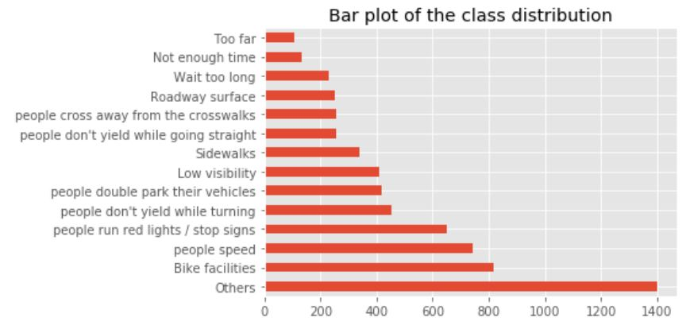

# text-classification-of-traffic-complaints

There are two main files:
1)  .travis.yml: To configure the Travis and set the environment for test
2)  hw4_starter_notebook.ipynb: The file containing the codes

The optimized results are as follows:
We got the ten most frequent words appearing in different topics and the best prediction accuracy 0.864.  

The steps in the code:
1)  Data Cleaning  
      
      - Load the data, visualize the class distribution. Clean up the target labels. Some categories have been arbitrarily split and need to be consolidated. 
2)  Model 1
      - Run a baseline multi-class classification model using a bag-of-word approach, report macro f1-score ( above .5) and visualize the confusion matrix and interpret the mistakes made by the model. 
3)  Model 2
      - Improve the model using more complex text features, including n-grams, character n-grams and possibly domain-specific features.
4)  Visualize Results
      - Visualize results of the tuned model (classification results, confusion matrix, important features, example mistakes).
5)  Clustering
      - Apply LDA, NMF and K-Means to the whole dataset and find clusters or topics that match well with some of the ground truth labels. Use ARI to compare the methods and visualize topics and clusters.
6)  Model 3
      - Improve the class definition for REQUESTTYPE by using the results of the clustering and results of the previous classification model. Re-assign labels using either the results of clustering or using keywords that we found during data exploration.
       - The data has a large “other” category. Apply the topic modeling and clustering techniques to this subset of the data to find possible splits of this class.
      Report accuracy using macro average f1 score (about 0.864) 
7)  Extra Steps
      - Use a word embedding representation like word2vec for step 3 and or step 6. 

